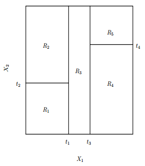
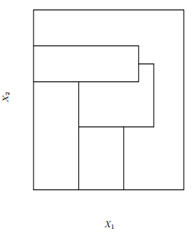

***
## Problem

This kernel presents concepts about how the Decision Trees (DT) works, to ilustrate it, i am going to use the Iris dataset and develop in R language.


```{r, message=F, echo=T, results=F}
# set the environment
suppressMessages({
        library(tidyverse)
        library(magrittr)
        library(knitr)
        library(GGally)
        library(rpart)
        library(rattle)
        library(rpart.utils)
        })  

setwd("~/Dropbox/kaggle/iris-species/")  
opts_chunk$set(cache=TRUE)  

data(iris)
iris %<>%  as_tibble()
```

The Iris dataset have measurements, width and height, of the petal and sepal of three kind of the Iris flower. These kinds can be seen bellow.

**Versicolor**  

&nbsp;

**Setosa**  

&nbsp;

**Virginica**  

&nbsp;

**Flower struct:**  


***

The dataset has 150 samples, it been 50 for each specie.

```{r}
iris %>%  head() %>% print()
```

***
## The Goal

To model a decision tree and solve the specie detection of iris dataset. In the way of the solution, i pretend to show the main alternative used in decision tree technique.  

But before modeling, it's need to split the data set into train and test sets, and prevent of generate any *bias* which affect the predictions of the test set.

```{r}
set.seed(654)
train_idx <- sample(nrow(iris), .75*nrow(iris))
train <- iris %>% slice(train_idx)
test <- iris %>% slice(-train_idx)
```

The dataset contains 4 predictors, how are they correlate? Is it possible that the classes have a clear separation in some 2-D variable plan ?

```{r, message=F, warning=F, results=F}
train %>%
        ggpairs(aes(colour=Species), columns=1:4, lower="blank", diag="blank", 
                  upper=list(continuous="points")) + theme_bw() 
```


Yes, it is very noticed a strong correlation between `Petal.Length` and `Petal.Width`. And also there's a clear separation between the class along the ranges of the petal size.

&nbsp;


***
## Machine Learning

Many times, what the algorithm try to do is split the Predictor Space $\Large{X}$ in subspaces that better separate the classes.


$$ \Large{\mathcal{F}} : X \rightarrow Y $$

***
## What decision trees are about?

- It's a non-parametric and non-linear method.
- It attacks the predictor space doing stratification and segmentation.

***

### Some Definitions
 
Seeing a generic DT graph bellow, which use only two predictors.  The tree has a top-down approach, the upper node is the Root. The inner nodes are the branches, and the terminal nodes are the leafs. Each leaf represents a subspace of the predictor space.


```{r}
tree.fit <- rpart("Species ~ Petal.Length + Petal.Width", train, control=rpart.control(cp=0, minbucket=1))
fancyRpartPlot(tree.fit, sub="")
```

***
### Decision Regions

```{r}
limiares <- rpart.subrules.table(tree.fit) %>% 
                as_tibble() %>%
                select(Variable, Less) %>% 
                filter(!is.na(Less)) %>% 
                mutate(Less=as.numeric(as.character(Less)))
                
limiares_pl <- limiares %>% filter(Variable=="Petal.Length") %>%  .$Less           
limiares_pw <- limiares %>% filter(Variable=="Petal.Width") %>%  .$Less           

x_axis <- train$Petal.Length %>% range()
y_axis <- train$Petal.Width %>% range()
n_points <- train %>% nrow()
            
train %>% ggplot(aes(x=Petal.Length, y=Petal.Width, colour=Species)) +
            geom_point() + theme_bw() + scale_x_continuous(breaks=seq(10,1)) +
            geom_line(aes(x=rep(limiares_pl[1], n_points), y=seq(y_axis[1], y_axis[2], length.out=n_points)), colour="black") + 
            geom_line(aes(x=seq(limiares_pl[2], x_axis[2], length.out=n_points), y=rep(limiares_pw[1], n_points)), colour="black") +
            geom_line(aes(x=rep(limiares_pl[2], n_points), y=seq(y_axis[1], y_axis[2], length.out=n_points)), colour="black") +
            geom_line(aes(x=seq(limiares_pl[2], x_axis[2], length.out=n_points), y=rep(limiares_pw[1], n_points)), colour="black") +
            geom_line(aes(x=rep(limiares_pl[3], n_points), y=seq(y_axis[1], limiares_pw[1], length.out=n_points)), colour="black") +
            geom_line(aes(x=seq(limiares_pl[3], x_axis[2], length.out=n_points), y=rep(limiares_pw[2], n_points)), colour="black")

```

Each microregion is a leaf,  and the 2D predictor space is segmented.  

Now, getting a examples from a random model, we can see a 2D predictor space represented as 3D to clarify the stratification stage, whereby each level is a level of the branch in the tree.

<div style="width:300px; height=200px">

</div>

Vista superior da figura 3D:
<div style="width:300px; height=200px">

</div>


*An important detail is about what a DT does not do, as the kind of segmentation bellow.*  

<div style="width:300px; height=200px">

</div>


***
### How build the tree ?

**-- Main idea:**

1. Choose the best predictor $A$ and its best threshold as the split point of the root.
2. Divide the trainset $S$ into subsets ${S_1, S_2, ..., S_k}$, which each subset must has only samples from the same value of decision chosen at **1**.
3. Recursively, apply the steps **1** and **2** for each new subset $S_i$ until all nodes have only elements of the same class.


** How choose the best predictor to split in the tree node??**

1. Error rate? -> it doesn't coverge well, it's not sensitive to the tree growth.

2. Gini index -> impurity measurement of the node.

$$G({s_i}) = \sum_{k=1}^{K}{\hat{p}_{{s_i}k}(1-\hat{p}_{{s_i}k})}$$

3. Entropy -> Quantity of disorder, and by the concept of *information theory*, it's the quantity of bits needed to store the information.

$$E({s_i}) = -\sum_{k=1}^K{\hat{p}_{{s_i}k}\log{{\hat{p}}_{{s_i}k}}}$$

***
The function behavior along two classes distribution in the node:

```{r}
f_gini <- function(p){ p*(1-p) + (1-p)*(1-(1-p)) }
f_entr <- function(p){ ifelse(p%in%c(0,1), 0, 
                              - (p*log(p, base=2) + (1-p)*log((1-p), base=2)))}

ps <- seq(0, 1, length.out=100)
y_gini <- sapply(ps, f_gini)
y_entr <- sapply(ps, f_entr)

ggplot(tibble(probs=ps)) +
        geom_line(aes(x=probs, y=y_gini, colour="Gini")) +
        geom_line(aes(x=probs, y=y_entr, colour="Entropia")) +
        theme_bw()

```

&nbsp;

#### **Example of split decision using entropy.**

To simplify the case, we keep the two dimensional predictor space, `Petal Length` e `Petal Width`.

**1 - Measuting entropy of root node:**

Mainly, the predictor space is shown bellow, in the case $S_1$, the root node.

```{r}
S1 <- train %>%  select(Petal.Length, Petal.Width, Species)

ggplot(S1, aes(x=Petal.Length, Petal.Width)) + 
        geom_point(aes(colour=Species)) +
        theme_bw()
```


To compute entropy, first it is needed the prior probability of each class.

$$E({s_i}) = -\sum_{k=1}^K{\hat{p}_{{s_i}k}\log{{\hat{p}}_{{s_i}k}}}$$

```{r}
S1 %>% group_by(Species) %>% 
        summarise(quantidade=n()) %>%
        mutate(prob=quantidade/sum(quantidade)) %>% 
        mutate(prob=round(prob, 3))
```

Sum results:
```{r}
E_S1 <- - (0.339*log(0.339, base=2) + 0.339*log(0.339, base=2) + 0.321*log(0.321, base=2)) 
print(E_S1)
```

&nbsp;


**2 - Split criteria:** 

To decide where to split, it uses the concept **Information Gain**, that's the entropy difference between the prior node and the successives node.

$$\Delta{E} = p(S_{1})E(S_{1}) - \Big[p(S_{11})E(S_{11}) + p(S_{12})E(S_{12})\Big]$$

In the case, we have two continuos variables. For each variable, all values of its range domain are checked as split point. The one that presents the best gain information is the chosen.

```{r}
fs_entropy <- function(S){
        if( nrow(S)==0){
                return( 0)
        }
        
        list_p <- S %>% 
                group_by(Species) %>% 
                summarise(quantidade=n()) %>%                   
                mutate(prob=quantidade/sum(quantidade)) %>% 
                .$prob
        
        list_p <- list_p[list_p > 0 | list_p < 1]
        entropia <- list_p %>% 
                        sapply(X=., FUN=function(p){ -p*log(p, base=2) }) %>%
                        sum()
        
        return(entropia)
}


delta_E <- tibble(attr=character(), thrs=numeric(), gain=numeric())
E_S1 <- fs_entropy(S1)
for( A in colnames(S1)[1:2]){
        range <- S1 %>% 
                select(eval(parse(text=A))) %>% 
                range()
        range_seq <- seq(range[1], range[2], 0.01)
        
        for( i in range_seq){
                S11 <- S1 %>% filter(get(A, pos=.) >= i)
                S12 <- S1 %>% filter(!get(A, pos=.) >= i)
                
                E_S11 <- fs_entropy(S11)
                E_S12 <- fs_entropy(S12)
                
                dE <- E_S1 - (1/nrow(S1))*(nrow(S11)*E_S11 + nrow(S12)*E_S12)        
                
                delta_E <- rbind.data.frame(delta_E, tibble(A, i, dE))
        
        }
        
        
}

ggplot(delta_E, aes(x=i, y=dE)) + 
        geom_line(aes(colour=A)) +
        facet_wrap(~A, nrow=1, scales="free_x") +
        theme_bw()

```

In this case, there's a tie between the two predictors with the same maximum gain. In `petal.length`, the maximum gain is the same along a sub-range of the domain.

```{r}
delta_E %>% filter(dE==max(dE)) %>%  filter(A=="Petal.Length") %>%  select(i) %>%  range()
```

The mean value of this sub-range is exactly the same chosen in the first decision tree (*The appearead number on the tree graph is not exactly the same because it is rounded*).

```{r}
(1.91+3)/2
```

&nbsp;

**3 - Repeat step 1 and 2.**

Reply the split process along all the new successives nodes.

&nbsp;

***
### Overfitting and Pruning tree


$$\sum_{m=1}^{|T|}\sum_{x_i\in{S_m}}(y_i - \hat{y}_{R_m})^2 + \alpha|T|$$


After the tree is completly built, the algorithm usually tends to overfit the training data, following a lot of particularity of the train data and unlikely these will appear in others data sets.

To prune the tree, a regulator $\alpha$  is added to the cost function, the regulator punish the function as the tree is growing. The function tends to converge at the moment that information gain of the node splits does not compensate the punish factor.

```{r}
tree.fit.pr <- prune(tree.fit, cp=0.1)
fancyRpartPlot(tree.fit.pr, sub="")
```

&nbsp;

***
### Comparing prediction between the entire and the pruned tree

The two follow numbers are the accuracy about the training set, the first one is using the entire tree and the second is using the pruned one. As expected the performance of the entire tree exceed the the pruned.

```{r}
train.pred.1 <- predict(tree.fit, train, type="class")
## acertividade no trainset
mean(train.pred.1==train$Species) %>% round(3) %>% `*`(., 100)
```

```{r}
train.pred.2 <- predict(tree.fit.pr, train, type="class")
## acertividade no trainset
mean(train.pred.2==train$Species) %>% round(3) %>% `*`(., 100)
```

&nbsp;

Now, on the testing set, the performance of both are equals. The pruned tree has a simpler structure and also can predict well the new observations.


```{r}
test.pred.1 <- predict(tree.fit, test, type="class")
## acertividade no testset
mean(test.pred.1==test$Species) %>% round(3) %>% `*`(., 100)
```


```{r}
test.pred.2 <- predict(tree.fit.pr, test, type="class")
## acertividade no testset
mean(test.pred.2==test$Species) %>% round(3) %>% `*`(., 100)

```

&nbsp;

***
## Ensembling

> There are more fancy methods based on decision trees and they can be much more powerful.

**Bagging**

- Based on bootstrap and parallel combination of the trees.

**Boosting**

- Serial combination of the trees. The foward tree is construct based on the output of the prior tree.

**Random Forest**

- Based on parallel combination of the trees, usually hundreds, and also use some tricks to generate decorrelate trees.


&nbsp;

***
## The A and the B side of the Decision Trees.

### Pros

- Good interpretability
- It works weel for every kind of data
- Insensible to outliers
- Easy to implement

### Cons

- It doesn't perform well for smooth and some linear boundaries.
- It tends to overfit the data, important to prune.
- It isn't competitive with the best supervised algorithms. Altough, using ensembling methods, it can be extreme powerful, but lose its interpretatibility.

&nbsp;

