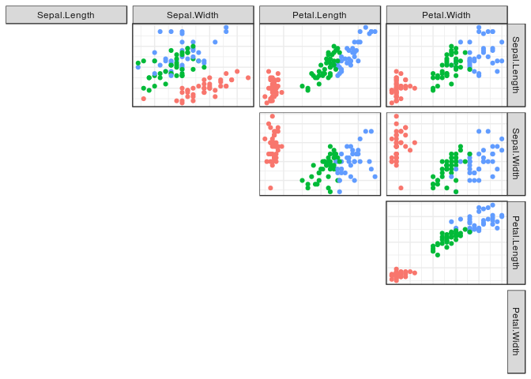
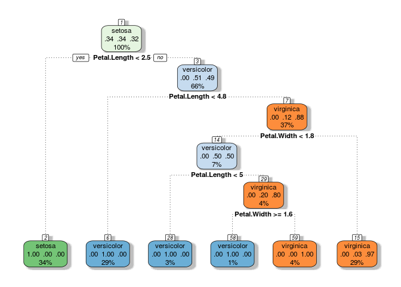
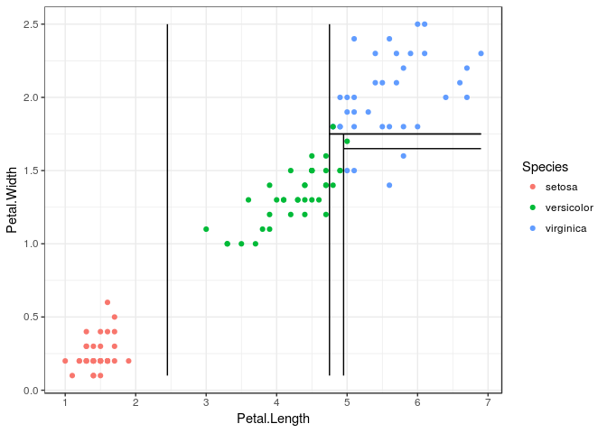
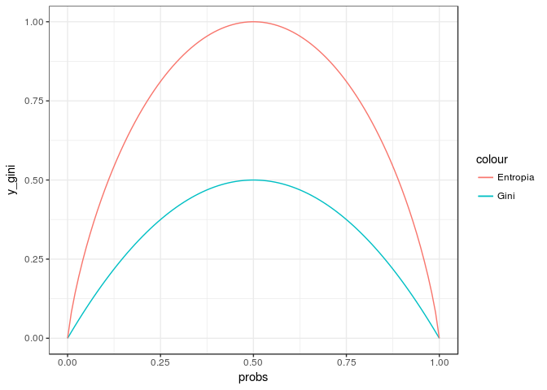
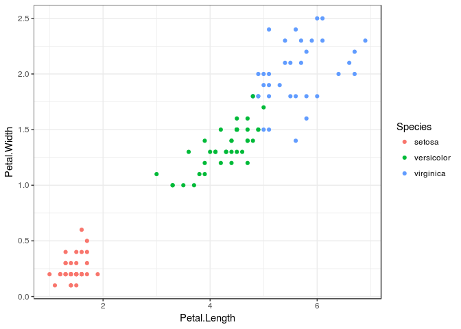
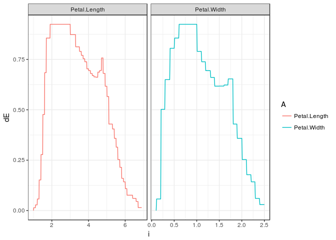
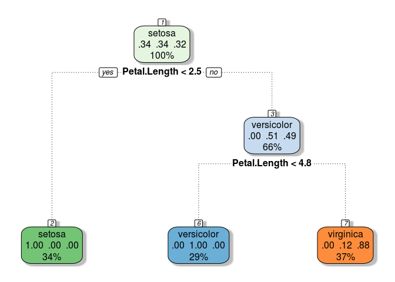

Árvores de Decisão
================

------------------------------------------------------------------------

O Problema
----------

Esse notebook introduz conceitos do algoritmo de **Árvore de Decisão** (AD), para ilustrações do fato, usarei o dataset *Iris*.

``` r
# estabelecendo o ambiente
suppressMessages({
        library(tidyverse)
        library(magrittr)
        library(knitr)
        library(GGally)
        library(rpart)
        library(rattle)
        library(rpart.utils)
        })  

setwd("~/Dropbox/kaggle/iris-species/")  
opts_chunk$set(cache=TRUE)  

data(iris)
iris %<>%  as_tibble()
```

O dataset Íris contém medidas de comprimento e largura da pétala e da sépala de três espécies de íris:

**Versicolor**


 

**Setosa**


 

**Virgínica**


 

**Estrutura da flor:**


------------------------------------------------------------------------

O dataset contém 150 amostras, 50 de cada espécie.

``` r
iris %>%  head() %>% print()
```

    ## # A tibble: 6 × 5
    ##   Sepal.Length Sepal.Width Petal.Length Petal.Width Species
    ##          <dbl>       <dbl>        <dbl>       <dbl>  <fctr>
    ## 1          5.1         3.5          1.4         0.2  setosa
    ## 2          4.9         3.0          1.4         0.2  setosa
    ## 3          4.7         3.2          1.3         0.2  setosa
    ## 4          4.6         3.1          1.5         0.2  setosa
    ## 5          5.0         3.6          1.4         0.2  setosa
    ## 6          5.4         3.9          1.7         0.4  setosa

------------------------------------------------------------------------

A missão
--------

Conhecer o algoritmo de Árvore de Decisão e criar um modelo possível de prever a espécie de íris a partir das medidas da pétala e sépala.

Antes da modelagem e análise em geral, o primeiro passo é dividir o conjunto em dados de treinamento e de teste. Para não criarmos um *bias* que influencie nas predições feitas sobre o conjunto de teste.

``` r
set.seed(654)
train_idx <- sample(nrow(iris), .75*nrow(iris))
train <- iris %>% slice(train_idx)
test <- iris %>% slice(-train_idx)
```

No dataset constam 4 preditores, é interessante checar o nível de correlação deles, e ou separação no plano que delineie as classes que queremos classificar.

``` r
train %>%
        ggpairs(aes(colour=Species), columns=1:4, lower="blank", diag="blank", 
                  upper=list(continuous="points")) + theme_bw() 
```



Algumas variáveis apresentam uma correlação bem forte, como `Petal.Length` e `Petal.Width`, e as regiões de tamanho das pétalas tem uma apresentam uma diferenciação bem clara das classes.

 

------------------------------------------------------------------------

Aprendizado de Máquina
----------------------

Dentro do espaço Preditor $\\Large{X}$ encontrar a melhor separação de sub-espaços que designem cada classe.

$$ \\Large{\\mathcal{F}} : X \\rightarrow Y $$

------------------------------------------------------------------------

Árvore de Decisão
-----------------

-   Método de classificação e regressão não-paramétrico e não-linear.
-   Envolve estratificação e segmentação do espaço de preditores em um número de pequenas regiões.

------------------------------------------------------------------------

### Definições

Olhando um exemplo genérico de AD para o caso íris na figura abaixo, nesse exemplo só constam 2 preditores.

-   Abordagem Top-Down -&gt; imagina a árvore invertida, o cume do grafo é a **Raiz**.
-   Os nós internos são **Ramais**.
-   Os nós terminais são **Folhas**, cada qual designa uma classe e representam micros-regiões oriundas da divisão do espaço de Preditores.

``` r
tree.fit <- rpart("Species ~ Petal.Length + Petal.Width", train, control=rpart.control(cp=0, minbucket=1))
fancyRpartPlot(tree.fit, sub="")
```



------------------------------------------------------------------------

### Regiões de decisão

``` r
limiares <- rpart.subrules.table(tree.fit) %>% 
                as_tibble() %>%
                select(Variable, Less) %>% 
                filter(!is.na(Less)) %>% 
                mutate(Less=as.numeric(as.character(Less)))
                
limiares_pl <- limiares %>% filter(Variable=="Petal.Length") %>%  .$Less           
limiares_pw <- limiares %>% filter(Variable=="Petal.Width") %>%  .$Less           

x_axis <- train$Petal.Length %>% range()
y_axis <- train$Petal.Width %>% range()
n_points <- train %>% nrow()
            
train %>% ggplot(aes(x=Petal.Length, y=Petal.Width, colour=Species)) +
            geom_point() + theme_bw() + scale_x_continuous(breaks=seq(10,1)) +
            geom_line(aes(x=rep(limiares_pl[1], n_points), y=seq(y_axis[1], y_axis[2], length.out=n_points)), colour="black") + 
            geom_line(aes(x=seq(limiares_pl[2], x_axis[2], length.out=n_points), y=rep(limiares_pw[1], n_points)), colour="black") +
            geom_line(aes(x=rep(limiares_pl[2], n_points), y=seq(y_axis[1], y_axis[2], length.out=n_points)), colour="black") +
            geom_line(aes(x=seq(limiares_pl[2], x_axis[2], length.out=n_points), y=rep(limiares_pw[1], n_points)), colour="black") +
            geom_line(aes(x=rep(limiares_pl[3], n_points), y=seq(y_axis[1], limiares_pw[1], length.out=n_points)), colour="black") +
            geom_line(aes(x=seq(limiares_pl[3], x_axis[2], length.out=n_points), y=rep(limiares_pw[2], n_points)), colour="black")
```



Cada micro-região representa uma folha. O espaço preditor 2-D está segmentado.

Agora,pondo uma figura 3D de um outro modelo aleatório como o de abaixo, percebemos também a estratificação, cada nível descreve a profundidade do ramal.


Vista superior da figura 3D:


*Outro detalhe importante sobre a divisão do espaço, trabalhando-se com AD, é o que não acontece, como abaixo:*


------------------------------------------------------------------------

### Como construir a árvore?

**-- Ideia Básica:**

1.  Escolha o melhor preditor *A* e o seu melhor limiar de decisão para raiz da árvore.
2.  Separe o trainset *S* e, subsets *S*<sub>1</sub>, *S*<sub>2</sub>, ..., *S*<sub>*k*</sub>, onde cada subset *S*<sub>*i*</sub> contém amostras de igual valor para a condição imposta.
3.  Recursivamente, aplique o algoritmo para cada novo subset *S*<sub>*i*</sub> até que todos os nós-terminais contenham a mesma classe.

**Como escolher o melhor preditor *feature* no nó da árvore?**

1.  Taxa do erro? -&gt; Não converge bem, não é sensitiva ao crescimento da árvore.

2.  Índice Gini -&gt; Medida de impureza do nó.

$$G({s\_i}) = \\sum\_{k=1}^{K}{\\hat{p}\_{{s\_i}k}(1-\\hat{p}\_{{s\_i}k})}$$

1.  Entropia -&gt; Quantidade de desordem, e pelo conceito da *teoria de informação*, a quantidade de bits necessário para guardar a variabilidade da informação.

$$E({s\_i}) = -\\sum\_{k=1}^K{\\hat{p}\_{{s\_i}k}\\log{{\\hat{p}}\_{{s\_i}k}}}$$

------------------------------------------------------------------------

O Comportamento das funções em relação a distribuição das classes dentro do nó:

``` r
f_gini <- function(p){ p*(1-p) + (1-p)*(1-(1-p)) }
f_entr <- function(p){ ifelse(p%in%c(0,1), 0, 
                              - (p*log(p, base=2) + (1-p)*log((1-p), base=2)))}

ps <- seq(0, 1, length.out=100)
y_gini <- sapply(ps, f_gini)
y_entr <- sapply(ps, f_entr)

ggplot(tibble(probs=ps)) +
        geom_line(aes(x=probs, y=y_gini, colour="Gini")) +
        geom_line(aes(x=probs, y=y_entr, colour="Entropia")) +
        theme_bw()
```



 

#### **Exemplo da escolha do critério de decisão usando Entropia.**

Para simplificação do caso, continuamos somente no espaço 2-D dos preditores `Petal Length` e `Petal Width`.

**1 - Medição de entropia no Nó Raiz.**

O espaço Preditor original é mostrado abaixo, no caso *S*<sub>1</sub>, a raiz da árvore.

``` r
S1 <- train %>%  select(Petal.Length, Petal.Width, Species)

ggplot(S1, aes(x=Petal.Length, Petal.Width)) + 
        geom_point(aes(colour=Species)) +
        theme_bw()
```



Para calcular a entropia, precisamos somente da probabilidade de cada classe.

$$E({s\_i}) = -\\sum\_{k=1}^K{\\hat{p}\_{{s\_i}k}\\log{{\\hat{p}}\_{{s\_i}k}}}$$

``` r
S1 %>% group_by(Species) %>% 
        summarise(quantidade=n()) %>%
        mutate(prob=quantidade/sum(quantidade)) %>% 
        mutate(prob=round(prob, 3))
```

    ## # A tibble: 3 × 3
    ##      Species quantidade  prob
    ##       <fctr>      <int> <dbl>
    ## 1     setosa         38 0.339
    ## 2 versicolor         38 0.339
    ## 3  virginica         36 0.321

Computando a somatória do nó:

``` r
E_S1 <- - (0.339*log(0.339, base=2) + 0.339*log(0.339, base=2) + 0.321*log(0.321, base=2)) 
print(E_S1)
```

    ## [1] 1.584349

 

**2 - Critério para divisão:**

Para decidir em quais dos pontos de decisão ocorrerá a divisão, usa-se o conceito de **Ganho de Informação**, que é a diferença de entropia entre os nós-filhos e o nó-pai.

*Δ**E* = *p*(*S*<sub>1</sub>)*E*(*S*<sub>1</sub>)−\[*p*(*S*<sub>11</sub>)*E*(*S*<sub>11</sub>)+*p*(*S*<sub>12</sub>)*E*(*S*<sub>12</sub>)\]

No nosso caso temos duas variáveis contínuas. Para cada atributo, são testados todos os valores contínuos do domínio daquela variável. O limiar que obter o maior valor de Ganho, é o selecionado.

``` r
fs_entropy <- function(S){
        if( nrow(S)==0){
                return( 0)
        }
        
        list_p <- S %>% 
                group_by(Species) %>% 
                summarise(quantidade=n()) %>%                   
                mutate(prob=quantidade/sum(quantidade)) %>% 
                .$prob
        
        list_p <- list_p[list_p > 0 | list_p < 1]
        entropia <- list_p %>% 
                        sapply(X=., FUN=function(p){ -p*log(p, base=2) }) %>%
                        sum()
        
        return(entropia)
}


delta_E <- tibble(attr=character(), thrs=numeric(), gain=numeric())
E_S1 <- fs_entropy(S1)
for( A in colnames(S1)[1:2]){
        range <- S1 %>% 
                select(eval(parse(text=A))) %>% 
                range()
        range_seq <- seq(range[1], range[2], 0.01)
        
        for( i in range_seq){
                S11 <- S1 %>% filter(get(A, pos=.) >= i)
                S12 <- S1 %>% filter(!get(A, pos=.) >= i)
                
                E_S11 <- fs_entropy(S11)
                E_S12 <- fs_entropy(S12)
                
                dE <- E_S1 - (1/nrow(S1))*(nrow(S11)*E_S11 + nrow(S12)*E_S12)        
                
                delta_E <- rbind.data.frame(delta_E, tibble(A, i, dE))
        
        }
        
        
}

ggplot(delta_E, aes(x=i, y=dE)) + 
        geom_line(aes(colour=A)) +
        facet_wrap(~A, nrow=1, scales="free_x") +
        theme_bw()
```



Aqui há um empate entre os dois atributos que antigem o mesmo o valor máximo de ganho. Em *petal.length*, o valor máximo se repete em uma faixa do domínio.

``` r
delta_E %>% filter(dE==max(dE)) %>%  filter(A=="Petal.Length") %>%  select(i) %>%  range()
```

    ## [1] 1.91 3.00

O valor médio dessa faixa é exatamente o valor de corte escolhido na nossa primeira árvore. (*O número aparente no diagrama árvore é arrendondado e por isso não bate exatamente.*)

``` r
(1.91+3)/2
```

    ## [1] 2.455

 

**3 - Repetir o passo 1 e 2.**

Replicar o processo de divisão com todos os novos nós-filhos gerados.

 

------------------------------------------------------------------------

### Podagem da Árvore e Overfitting

<p align="center">

</p>

$$\\sum\_{m=1}^{|T|}\\sum\_{x\_i\\in{S\_m}}(y\_i - \\hat{y}\_{R\_m})^2 + \\alpha|T|$$

Após a árvore completamente modelada, existe uma tendência do algoritmo super ajustar os limites de decisão ao conjunto de treinamento, o algoritmo acaba aprendendo informações particulares do conjunto que são aleatoriedades da informação, e não necessariamente se repetirão para o conjunto de teste.

Para a podagem, adiciona-se um regulador *α* que penaliza cada vez que o comprimento da árvore |*T*| cresça. A função converge, por exemplo, no momento que o ganho da divisão do nó não compensa mais o fator de punição.

``` r
tree.fit.pr <- prune(tree.fit, cp=0.1)
fancyRpartPlot(tree.fit.pr, sub="")
```



 

------------------------------------------------------------------------

### Comparando predição entre a árvore inteira e a podada.

Os dois primeiros números são a acertividade sobre o conjunto de treinamento, o primeiro valor é o da árvore inteira e o segundo a da podada, como esperado a da árvore intera se sobressai em performance, possuindo mais profundidade que segmente todas nuances do conjunto.

``` r
train.pred.1 <- predict(tree.fit, train, type="class")
## acertividade no trainset
mean(train.pred.1==train$Species) %>% round(3) %>% `*`(., 100)
```

    ## [1] 99.1

``` r
train.pred.2 <- predict(tree.fit.pr, train, type="class")
## acertividade no trainset
mean(train.pred.2==train$Species) %>% round(3) %>% `*`(., 100)
```

    ## [1] 95.5

 

Agora no conjunto de teste, a performance de ambas são equivalentes A árvore podada, de estrutura menos complexa, consegue atender igualmente predições para as amostras novas.

``` r
test.pred.1 <- predict(tree.fit, test, type="class")
## acertividade no testset
mean(test.pred.1==test$Species) %>% round(3) %>% `*`(., 100)
```

    ## [1] 94.7

``` r
test.pred.2 <- predict(tree.fit.pr, test, type="class")
## acertividade no testset
mean(test.pred.2==test$Species) %>% round(3) %>% `*`(., 100)
```

    ## [1] 94.7

 

------------------------------------------------------------------------

Elencamentos
------------

> Construções de modelos bem mais poderosos usando árvores.

**Bagging**

-   Bootstrap e combinação paralela.

**Boosting**

-   Combinação serial das árvores.

**Random Forest**

-   Combinação paralela das árvores ( *normalmente com centenas* ) e truques de decorrelação entre as árvores.

 

------------------------------------------------------------------------

O Lado A e B do modelos de Árvore de Decisão
--------------------------------------------

### Prós

-   Boa interpretabilidade.
-   Funciona bem para todos os tipos de dados (caractere, fator, númerico, booleano).
-   Insensível a outliers.
-   Fácil de implementar.

### Contras

-   Não performa bem para limites lineares ou suaves.
-   Tendência a overfitting (segue demasiado o *ruído*)
-   Não competitvo aos melhores algortimos de aprendizado supervisionado. Contudo com os métodos de elencamento, é extremamente poderoso, mas perde a interpretabilidade.
